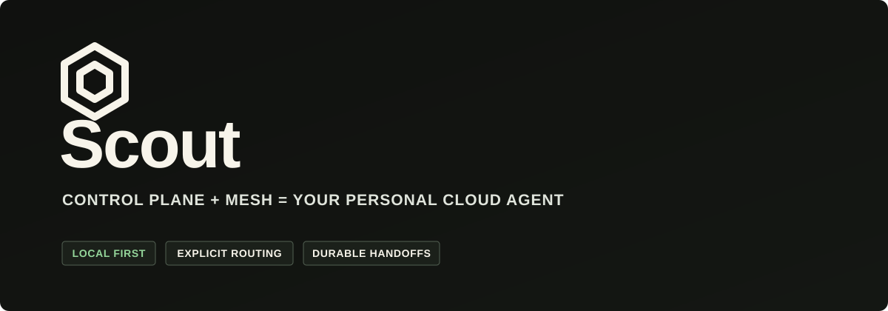

<p align="center">
  
</p>

<p align="center">
  <strong>Open infrastructure for your personal agent cloud.</strong><br />
  A local control plane and mesh network across the machines you own.
</p>

<p align="center">
  <a href="https://github.com/oscout/scout"></a>
  <a href="https://www.npmjs.com/package/@openscout/scout"></a>
  <a href="https://oscout.net"></a>
</p>

---

We build the public core of **OpenScout**: a local-first control plane for
discovering coding-agent sessions, routing work, and keeping coordination
durable across tools and machines.

> **Local control plane + mesh network = your personal agent cloud.**

## Start with Scout

[`oscout/scout`](https://github.com/oscout/scout) is the CLI, broker, runtime,
protocol, and local web surface behind the OpenScout agent mesh.

```bash
bun add -g @openscout/scout

scout setup
scout doctor
scout ask --project . --harness codex "Review this repository."
```

## What guides the work

| Principle | In practice |
| --- | --- |
| **Local first** | Your broker and coordination state stay under your control. |
| **Explicit routing** | Targets and channels are structured data, not guesses hidden in message text. |
| **Durable coordination** | Requests, flights, replies, and handoffs survive individual sessions. |
| **Observed transcripts** | External harness history remains source material, not silently imported first-party chat. |
| **Honest mesh semantics** | Mesh means reachability and coordination—not global consensus or exactly-once delivery. |

OpenScout is currently built for high-trust local developer pilots. We are
shipping the foundations in public while the product is still young, and we
avoid claiming enterprise or compliance readiness before it exists.

## Find your way in

- [Install Scout](https://github.com/oscout/scout#start-in-60-seconds)
- [Read the architecture](https://github.com/oscout/scout#one-broker-many-surfaces)
- [Contribute](https://github.com/oscout/scout/blob/main/CONTRIBUTING.md)
- [Get support](https://github.com/oscout/scout/blob/main/SUPPORT.md)
- [Report a security issue](https://github.com/oscout/scout/security/policy)

<p align="center"><sub>Built for operators who want agents to collaborate without surrendering the controls.</sub></p>
